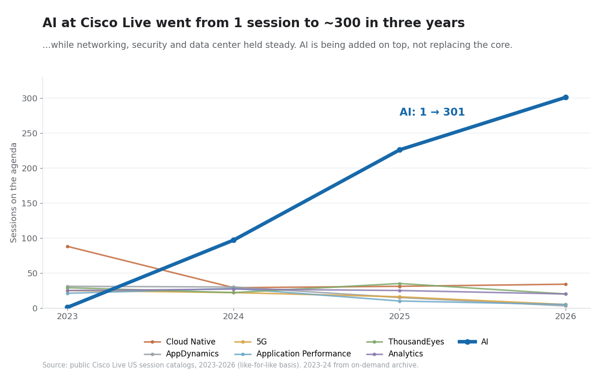

# Cisco Live Session Catalogs, 2023–2026

A reproducible dataset and analysis of what Cisco puts on the agenda at Cisco Live (US), pulled from the public session catalogs for 2023 through 2026. Built to answer one question with data instead of hype: **where is the network market actually heading?**



## TL;DR

- AI sessions went from **1 in 2023 to ~300 in 2026**.
- Networking, Security, and Data Center **held steady or grew** over the same period. AI was added on top, not swapped in.
- The only category in real decline is legacy observability tooling (AppDynamics, Application Performance, ThousandEyes) as it consolidates under Splunk.
- All declining technologies combined total about −134 sessions, less than half of AI's +300. The growth is mostly net-new, not displacement.

## What's in here

| File | Contents |
|------|----------|
| `data/cl2023_sessions.json` | US 2023 (Las Vegas) sessions |
| `data/cl2024_sessions.json` | US 2024 (Las Vegas) sessions |
| `data/cl2025_sessions.json` | US 2025 (San Diego) sessions |
| `data/cl2026_sessions.json` | US 2026 (Las Vegas) sessions |
| `fetch.py` | Pulls the catalogs from the RainFocus API and regenerates the JSON |
| `analyze.py` | Reproduces the counts and the chart |
| `cisco_live_ai_trend.png` | The chart above |

Each record holds factual metadata only: session code, title, type, length, tracks, technical level, technologies, speaker names/companies/roles, and (for live events) schedule. Long-form abstracts and speaker bios are **not** redistributed here; `fetch.py` will pull them on demand if you want them locally.

## Record schema

```json
{
  "code": "BRKAI-1010",
  "title": "An Introduction to Agentic AI",
  "type": "Breakout",
  "lengthMinutes": 60,
  "tracks": ["AI"],
  "technicalLevel": "Introductory",
  "technologies": ["AI", "AI Assistant"],
  "focus": ["New Technology"],
  "speakers": [{"name": "...", "company": "Cisco", "jobTitle": "...", "role": "Speaker"}],
  "schedule": [{"date": "2026-06-01", "day": "Monday", "start": "08:00", "end": "09:00 AM", "room": "..."}],
  "sessionID": "...",
  "externalID": "..."
}
```

## Methodology

The catalogs are served by Cisco's RainFocus backend (`events.rainfocus.com/api/search`). `fetch.py` reads the per-event widget credentials from each event's public `catalog.js`, then paginates the search endpoint and normalizes the result.

- **2025 and 2026** come from the live event catalogs, which list every session type (breakouts, labs, demos, seminars, and so on).
- **2023 and 2024** live catalogs have been decommissioned, so those years come from Cisco's On-Demand Library, which only contains sessions that were **recorded**. That archive excludes non-recorded formats (walk-in/instructor-led labs, demos, seminars, capture-the-flag, and similar).

## Read the caveats before quoting the numbers

1. **2023/2024 are recorded-only.** They undercount the full catalog by roughly 600+ non-recorded sessions per year. Trends are read on a **like-for-like basis**: only session types present in all four years (Breakout, World of Solutions, DevNet, Product/Strategy Overview, TAC, IT Leadership, Customer Success Story, Keynote).
2. **Track vs technology tagging differs.** The "Track" attribute is region- and year-dependent. The cross-event comparisons use the **Technology** tag, which is populated consistently. AI figures use Technology = "AI".
3. **A conference agenda is a signal, not a labor statistic.** It indicates where the vendor is steering the market, not the job market itself.
4. **Multi-tagging.** A session can carry several technology tags, so category counts do not sum to the catalog total.

## Reproduce it

```bash
pip install -r requirements.txt
python fetch.py        # writes data/cl20XX_sessions.json
python analyze.py      # prints the counts and writes cisco_live_ai_trend.png
```

## Data ownership and use

Session content (titles, abstracts, speaker bios) is the property of Cisco Systems and the respective speakers, sourced from the public Cisco Live session catalogs. This repository is shared for non-commercial research and analysis and redistributes factual metadata only. If you represent Cisco or a listed speaker and want something adjusted or removed, open an issue.

## License

Code: MIT. Data: factual metadata, provided as-is for research; see the note above.
